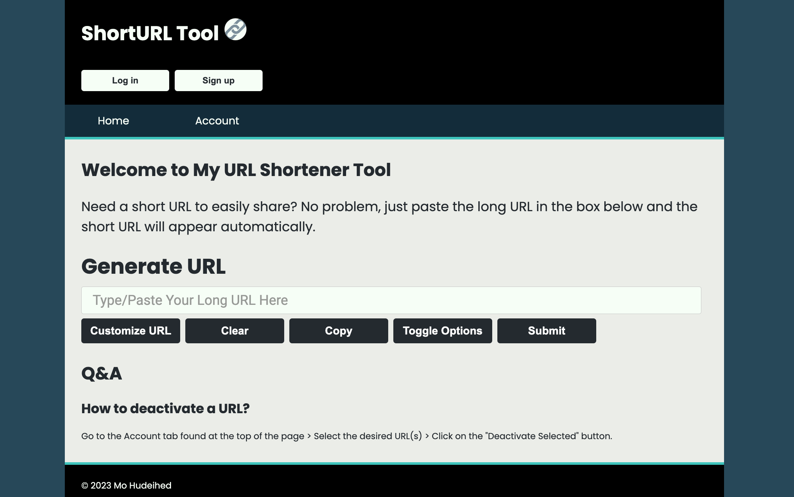
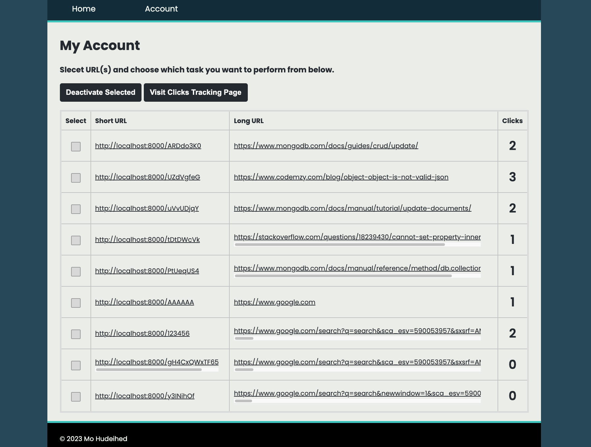
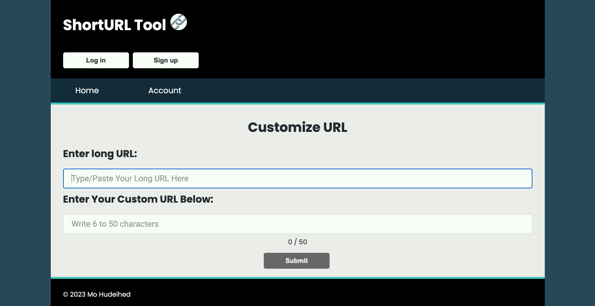

# ShortURL

ShortURL is a tool that convert lengthy URLs to short and easily shareable links. It allos click tracking and simple managing of multiple links along with some optional short URL customization.

- [Example](#example)
- [Project Screenshots](#project-screenshots)
  - [Home Page](#home-page)
  - [Manage URLs](#manage-urls)
  - [Custom URL](#custom_url)

## Example

A Google search URL of the terms "hello world" looks like this:

```sh
https://www.google.com/search?q=hello+world&newwindow=1&sca_esv=13f83d3e4d744b27&sxsrf=ADLYWIIB9cmrTgBZLn5P9inAvwhD0j_gSg%3A1718323180986&source=hp&ei=7IdrZt7FOfvA0PEPuImC2As&iflsig=AL9hbdgAAAAAZmuV_Pe6NxMZt1TbvnhIRmWP16kXWDyE&ved=0ahUKEwje67zW5NmGAxV7IDQIHbiEALsQ4dUDCBc&uact=5&oq=hello+world&gs_lp=Egdnd3Mtd2l6IgtoZWxsbyB3b3JsZDIIEAAYgAQYsQMyCBAuGIAEGLEDMggQABiABBixAzIIEAAYgAQYsQMyCBAAGIAEGLEDMggQABiABBixAzIFEC4YgAQyBRAAGIAEMgUQABiABDIFEAAYgARI8iRQAFjTH3AAeACQAQCYAVCgAe8FqgECMTG4AQPIAQD4AQGYAgugAqIGwgIREC4YgAQYsQMY0QMYgwEYxwHCAgsQABiABBixAxiDAcICDhAuGIAEGLEDGIMBGIoFwgIOEC4YgAQYsQMY0QMYxwHCAgsQLhiABBjRAxjHAcICDhAuGIAEGMcBGI4FGK8BwgILEC4YgAQYxwEYrwHCAg4QABiABBixAxiDARiKBcICCxAuGIAEGLEDGNQCmAMAkgcCMTGgB6uaAQ&sclient=gws-wiz
```

By pasting that into the URL box on the home page, ShortURL tool generates a short URL for us that references the long link above, which looks something like this:

```sh
http://localhost:8000/uG8SleyD
```

When someone visits this short link, they will be redirected to the long URL. 

> [!Note]
> If the short URL is decativeated, it cannot refernce the long URL and will no longer be valid. However, it can be reused to reference a new long URL, if desired, from the `Customize URL` button found on the home page.

## Project Screenshots

### Home Page



### Manage URLs



### Custom_URL


